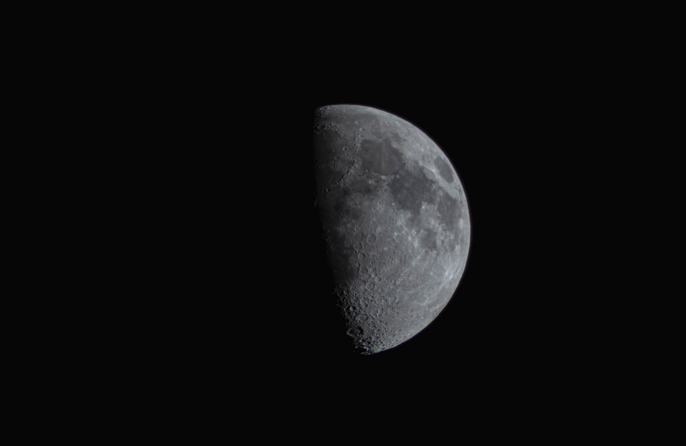

## who am I?
Hi! Thanks for visiting my page. 

My name is Daniel Park; currently a new grad out of Vanderbilt working at Cisco as a data scientist. My research interests go far beyond data science, however. I'm currently independently studying HPC and systems programming, specifically for ML workloads, to help contribute to open-source software. 

While you're here, you should check out my blogposts too! I occasionally write on technical topics that I find interesting, both as a way to document my own academic journey and share my learnings with others.

Outside of intellectual *stuff*, I love cooking (+ eating), playing volleyball, weightlifting, playing with cats, and dabbling in (astro)photography. I was also formerly an independent music producer and on an indie band called Bittermilk with my high school friends:



## OSS I've worked on
- HipKittens (ThunderKittens port to AMD GPUs)
  - [authored backend tile and MMA support for `fp8`](https://github.com/HazyResearch/HipKittens/pull/52#)
  - [wrote `fp8fp32` unscaled GEMM kernel, beating hipBLASLt on AMD MI300x / MI325x GPUs](https://github.com/HazyResearch/HipKittens/pull/52#)

## technologies I often use
- Python
- C++
- CUDA / HIP
- Linux

> [!NOTE]+ some pictures of / by me
> 
> 
> 
> 
> 
>
> 